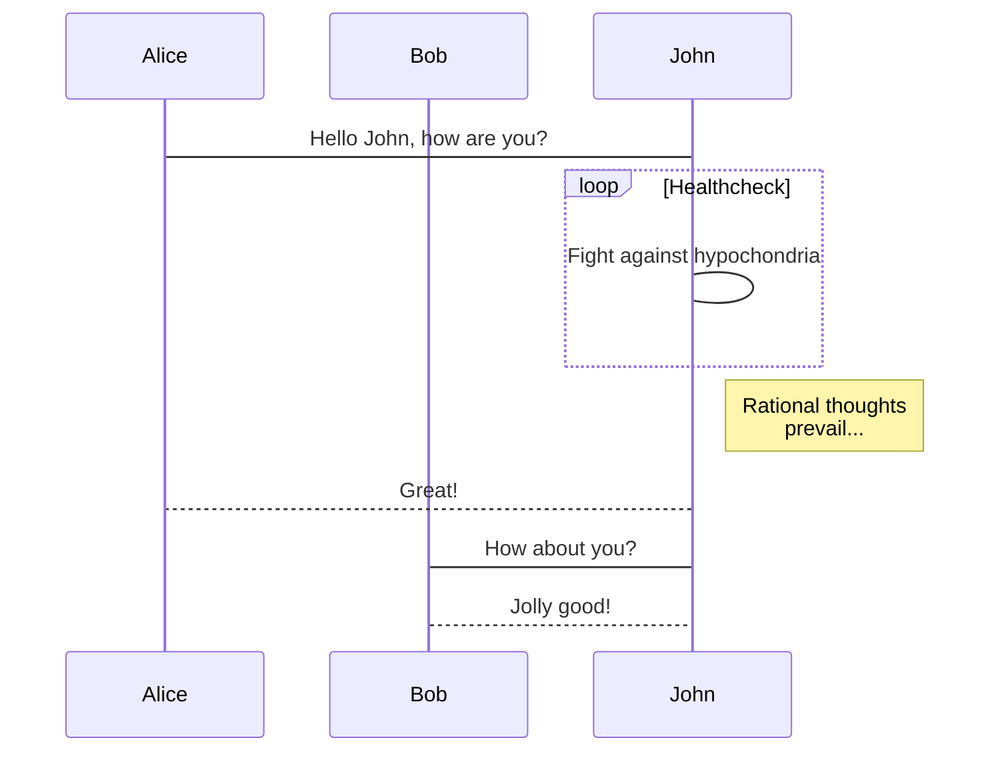

테스트 전용.


수학식 예시
$$
\begin{align*}
y = y(x, t) &= Ae^{i\theta} \\
            &= i \cos\theta + i\sin\theta \\
            &= 123
\end{align*}
$$


시퀀스다이어그램 예시

```sequence
클라 -> 서버 : request loginData
Note right of 서버 : Data Processing
서버 --> 클라 : result loginData
Note left of 클라 : login Processing
```


플로우 차트 예시

```flow
st=>start: Start
op=>operation: Your Operation
cond=>condition: Yes or No?
e=>end

st->op->cond
cond(yes)->e
cond(no)->op
```


클래스 다이어그램 예시



